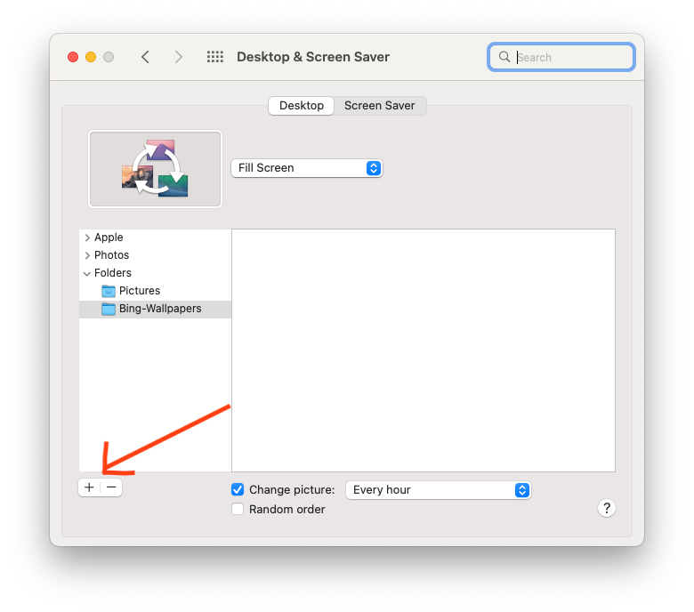

# Bing Desktop Wallpaper for Macs
This application can be used to change and refresh your Mac desktop wallpaper every day from Bing.

*Note: This application is tested with only Macs. For any other operating system you can try but it is not recommended.*
## Installation
---
You can deploy this application either using installation script (recommended) or manually.
* ### Installing with script

    You can install the script using the following command. Copy this command and paste it on your Mac terminal.

    ```bash
    sh -c "$(curl -fsSL https://raw.githubusercontent.com/sakiv/bing-wallpaper-mac/main/install.sh)"
    ```

    If you get below warning, then just to troubleshooting section - [Desktop wallpaper not changing](#set-desktop-wallpaper)
    ```bash
    Warning: We were not able to set Desktop Wallpaper systematically, please perform final step to complete installation
    ```

* ### Installing manually
    *Note: You have to follow these steps in sequence. If you miss any one of these steps then application may not work as expected.* 

    * Download latest compressed file, i.e. `bing-wallpaper-mac.tar.gz`, from the [releases](https://github.com/sakiv/bing-wallpaper-mac/releases) page.
    * Extract file either by double clicking on it or using following command on terminal (assuming you have downloaded the file in your home directory - $HOME or ~)
        ```bash
        tar -xvf ~/bing-wallpaper-mac.tar.gz -C ~/bing-wallpaper-mac
        ```
        Expected output
        ```
        x ./
        x ./LICENSE
        x ./README.md
        x ./com.yourname.bing-wallpaper.plist
        x ./bing-wallpaper.sh
        ```
    * After extracting files, you should see the following files
        ```
        |-- bing-wallpaper.sh    
        |-- com.yourname.bing-wallpaper.plist    
        │-- LICENSE
        │-- README.md
        ```
    * Rename `com.yourname.bing-wallpaper.plist` file to appropriate name, for example - `com.johndoe.bing-wallpaper.plist`
        ```bash
        mv ~/bing-wallpaper-mac/com.yourname.bing-wallpaper.plist ~/bing-wallpaper-mac/com.johndoe.bing-wallpaper.plist
        ```
    * Now open `com.johndoe.bing-wallpaper.plist` file in an editor of your choice, and replace the following lines with appropriate values
        ```xml
        <!-- Replace {YOUR-NAME} with appropriate name used in previous step, for example - johndoe -->
        <string>com.{YOUR-NAME}.bing-wallpaper</string>
        ...
        ...
        <!-- Replace {TARGET-FOLDER} where you have extracted the tar file, for example - ~/bing-wallpaper-mac -->
            <string>{TARGET-FOLDER}/bing-wallpaper.sh</string>
        </array>
        ```
    * Move newly renamed file `com.johndoe.bing-wallpaper.plist` to `~/Library/LaunchAgents` folder
        ```bash
        mv ~/bing-wallpaper-mac/com.johndoe.bing-wallpaper.plist ~/Library/LaunchAgents/
        ```
    * Run the following command on terminal to register the script with Mac OS
        ```bash
        launchctl load ~/Library/LaunchAgents/com.johndoe.bing-wallpaper.plist
        ```
    * To verify that script is successfully registered with Mac OS, run the following command on the terminal
        ```bash
        launchctl list | grep com.johndoe.bing-wallpaper
        ```
        Expected output.         
        ```        
        -	0	com.johndoe.bing-wallpaper
        ```
        *Note: If registration did not go thru successfully then you will see empty output*

## Post Installation Steps
---
Now as you have deployed the application, it needs to be updated in System Preferences. Check section [Set desktop wallpaper manually](#set-desktop-wallpaper)


## Troubleshooting
---
Sometimes things can go wrong, we have tried to list down possible failure scenarios and how to fix them.

<a name="set-desktop-wallpaper"></a>
<details open>
<summary>Desktop wallpaper not changing</summary>

* Navigate to System Preferences by clicking Apple icon on top-right of your screen and then click on `System Preferences`
* Click on `Desktop & Screen Saver`
* Add folder by clicking on `+` sign and navigating to `$HOME/Pictures/Bing-Wallpapers`

    *Note: You should select the folder and not the individual file*

</details>

<details open>
<summary>Application not registered with Mac OS</summary>

```
Unload failed: 5: Input/output error
Try running `launchctl bootout` as root for richer errors.
```
Run following to verify that application is registered with Mac OS or not
```bash
launchctl list | grep com.johndoe.bing-wallpaper
```
If you get empty response then run following command to register application
```bash
launchctl load ~/Library/LaunchAgents/com.johndoe.bing-wallpaper.plist
```

</details>

## Manually packaging application
---
In scenarios where the application needs to be manually packaged, you can use the following command in root folder of source repository.
```bash
tar --exclude-vcs --exclude=".DS_Store" --exclude="assets" --exclude="*.tar.gz" --exclude="install.sh" -cvf bing-wallpaper-mac.tar.gz .
```

## License
---
This application is licensed under the MIT license.

## Contributors
---
If you would like to contribute to this project, please contact the author of this project.